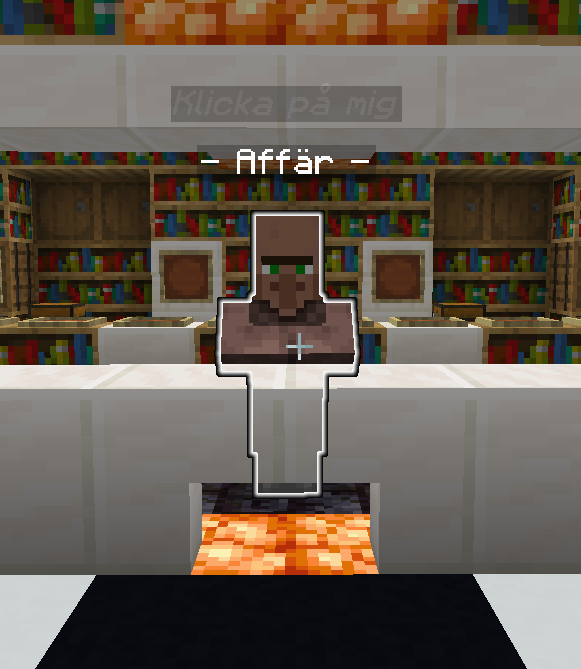
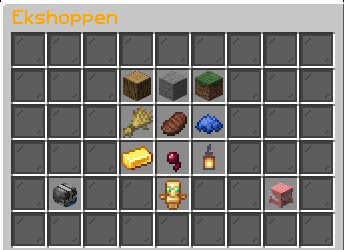

# Information
Towny är öppen för alla spelare  
Här kan man claima områden som skyddas mot både mobs och spelare  

## Svårhetsgrad
Servern är inställd på HARD

## KeepInventory
KeepInventory är aktiverat på hela servern.

## ServerShop
För att handla i vår servershop så måste man ta sig till Gallerian.  
Den hittar du antingen genom portalen i spawn eller genom att skriva `/warp galleria`.  

I denna kan du köpa nästan allt du kan behöva.  

### Öppna affären
Prata med NPC:n som står vid disken för att öppna affären.  

Sedan kan du välja kategori.  
Det kan vara allt från byggblock till totems och flygtid.  
I denna meny finns även en genväg till spelarnas egna affärer.  
