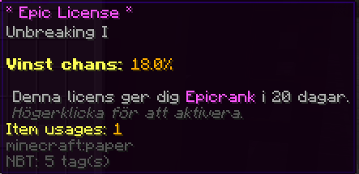

# Ranker

## Epic
Epic ranken kan man få genom Epic kistan i spawn.  

### Fördelar
- Sitt på trappor 
  - *(antingen genom att högerklicka på dem eller med kommandot nedan)* 
- Sortera dina kistor enkelt  
- Skriv färgade meddelanden i chatten  
- Redigera en tavla genom att shift+högerklicka på den och scrolla  
  *Du måste ha en tavla i handen när du shift+högerklickar på den du vill redigera*   

- Öppna shulkers med shift+högerklick. Detta gör att du inte behöver placera ut den.
- Kommandon  
  - `/workbench`  
  - `/tpbypass`  
  - `/sit`  
  - `/hat`  
  - `/enderchest`  
  - `/cplaytime`  
  - `/colors`  
  - `/sort`  